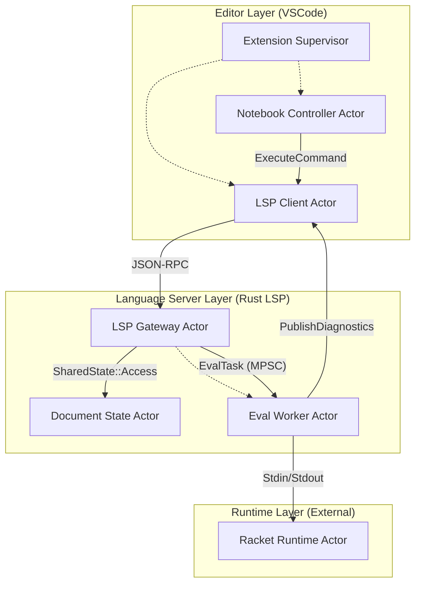
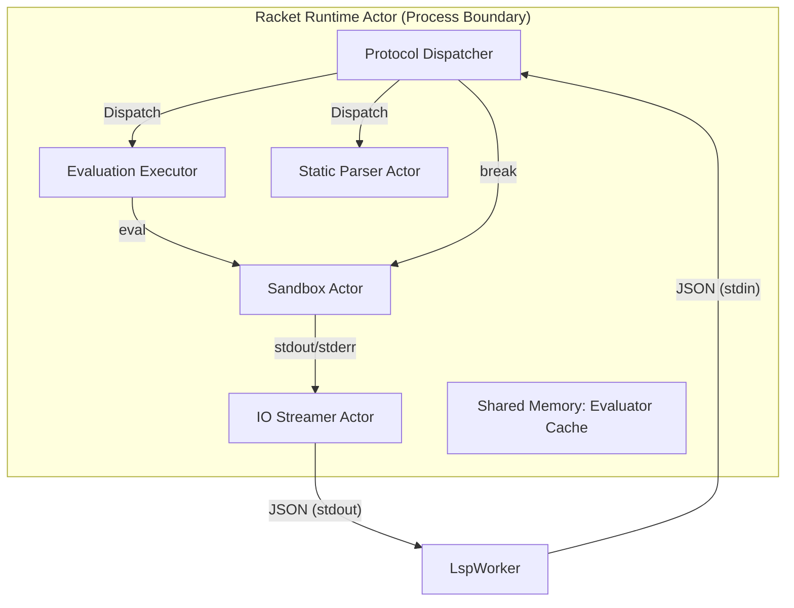
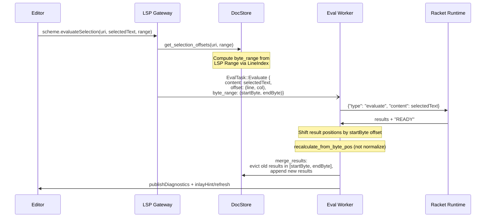
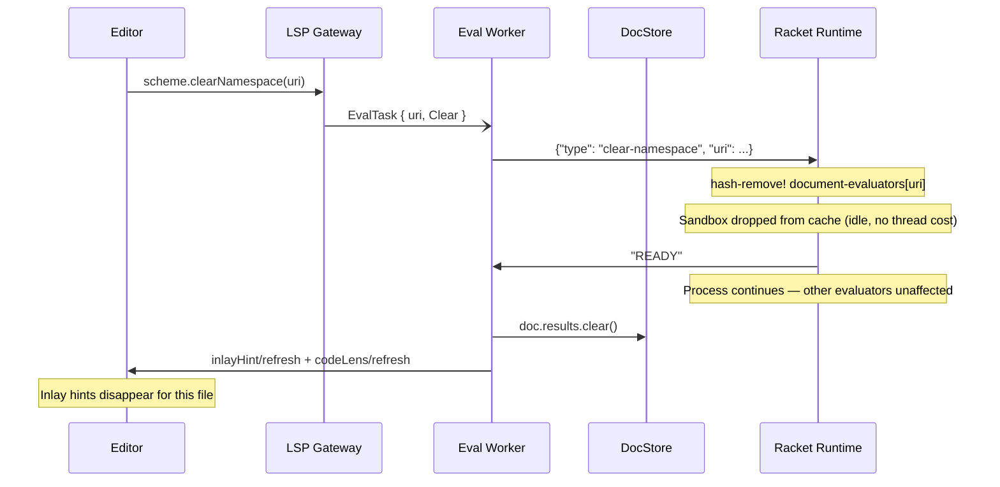
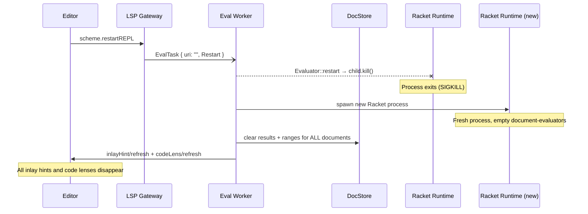

# Architectural Analysis: Actor Model Perspective

This document provides a structural decomposition of the `tools-scheme` project into an Actor-based asynchronous system.

## High-Level Actor Map

---

## Actor Breakdown

### 1. LSP Gateway Actor (`lsp/src/server.rs`)
- **Role:** The system's "Postmaster". It acts as the primary interface for external JSON-RPC communication.
- **Mailbox:** `lsp_server::Connection` (Stdio).
- **State:** Channel senders (`eval_tx`, `cancel_tx`) and a handle to the Shared State.
- **Behavior:**
  - Decodes incoming requests/notifications.
  - Synchronously updates the **Document State Actor** for `didChange` notifications.
  - Asynchronously dispatches heavy tasks (evaluation, parsing) to the **Eval Worker Actor**.
- **Supervision:** Managed by the process `main` loop.

### 2. Eval Worker Actor (`lsp/src/worker.rs`)
- **Role:** Dedicated execution thread. Isolates the blocking and stateful nature of the Racket REPL.
- **Mailbox:** `crossbeam_channel::Receiver<EvalTask>`.
- **State:** Owns the `Evaluator` instance and the Racket child process handle.
- **Behavior:**
  - Serializes requests to the **Racket Runtime Actor**.
  - Monitors the `cancel_rx` mailbox during notebook cell execution.
  - Computes diagnostics and inlay hints based on evaluation results.
  - Sends results back to the Editor via the `MessageSender` interface.
- **Supervision:** Spawned and monitored by the LSP `main.rs`.

### 3. Document State Actor (`lsp/src/documents.rs`)
- **Role:** Source of Truth for the project's text content.
- **Mailbox:** `RwLock` protected interface.
- **State:** Map of `Url` to `Document` (text, version, and line indexing).
- **Behavior:**
  - Responds to `Update` messages with incremental or full text synchronization.
  - Provides `LineIndex` calculations for coordinate mapping (UTF-8/UTF-16/Line-Col).

### 4. Notebook Controller Actor (`editors/vscode/src/notebookController.ts`)
- **Role:** Orchestrator for interactive notebook sessions.
- **Mailbox:** VS Code Notebook API events (`onDidChangeNotebookCells`, `executeHandler`).
- **State:** Current execution counts and references to active cells.
- **Behavior:**
  - Translates cell execution requests into `workspace/executeCommand` messages.
  - Listens for asynchronous result notifications from the LSP to update cell outputs.

---

## Racket Runtime Actor: Deeper Decomposition

Following a structural analysis of `lsp/src/eval-shim.rkt`, the **Racket Runtime Actor** is not a monolithic execution block but a micro-orchestrator managing several internal sub-actors and specialized behaviors.

### High-Level Internal Map

### Internal Actors & Behaviors

#### 1. Protocol Dispatcher ("The Front Office")
- **Logic:** `run-repl` function.
- **Mailbox:** Stdin (Line-buffered JSON).
- **State:** `current-eval-thread`, `current-evaluator`.
- **Behavior:**
  - **Route:** Inspects the `type` field (`evaluate`, `parse`, `cancel-evaluation`).
  - **Lifecycle:** Spawns the **Evaluation Executor** for long-running tasks to keep the dispatcher responsive to `cancel` messages.
  - **Sync:** Emits `READY` signals to the LSP to manage backpressure.

#### 2. Evaluation Executor ("The Worker")
- **Logic:** `evaluate-string-content` inside a Racket `thread`.
- **Mailbox:** Implicit (via the thread handle).
- **State:** The code to evaluate and the target URI.
- **Behavior:**
  - Pulls a **Sandbox Actor** from the cache or creates a new one.
  - Iterates through syntax forms using `for-each-syntax`.
  - Handles `exn:fail` by capturing source locations and reporting them as structured errors.

#### 3. Sandbox Actor ("The Isolated Container")
- **Logic:** `racket/sandbox`.
- **Mailbox:** `eval` calls and `break-evaluator` signals.
- **State:** A dedicated `namespace`, memory limits (128MB), and execution timeouts (15s).
- **Behavior:**
  - Provides a "clean room" for evaluation.
  - Enforces security and resource boundaries.
  - Supports `break` signals to interrupt infinite loops without killing the parent Racket process.

#### 4. IO Streamer Actor ("The Reporter")
- **Logic:** `make-streaming-port`.
- **Mailbox:** Bytes written to `current-output-port` or `current-error-port` inside the sandbox.
- **Behavior:**
  - **Intercept:** Transcodes raw bytes to UTF-8 strings.
  - **Structure:** Wraps data in a JSON envelope: `{"type": "output", "stream": "stdout", "data": "..."}`.
  - **Flush:** Immediately writes to the real process `stdout` for real-time feedback in the UI.

#### 5. Static Parser Actor ("The Analyzer")
- **Logic:** `parse-string-content`.
- **Behavior:**
  - Non-executing analysis. It uses `read-syntax` to walk the code structure.
  - **Message:** Emits `type: range` messages for every top-level form.
  - This allows the LSP to draw inlay hints and "Evaluate" buttons before a single line of user code is actually run.

#### 6. Rich Media Converter (Capability)
- **Logic:** `snip->base64-png`.
- **Behavior:**
  - Intercepts return values that satisfy `is-a? val snip%`.
  - Triggers a graphical render using `bitmap-dc%`.
  - Serializes the result to a `mime: image/png` JSON payload, allowing the actor to "speak" in graphics.

### Key Asynchronous Patterns
- **Non-blocking Cancellation:** By running evaluation in a separate thread, the **Protocol Dispatcher** can receive a `cancel-evaluation` message and immediately invoke `break-evaluator`, which triggers a `break-thread` in the **Evaluation Executor**.
- **State Persistence:** The `document-evaluators` hash map acts as a "registry" of actors. Each URI effectively has its own persistent actor state (the namespace), allowing variables defined in one cell execution to be available in the next.

---

## Asynchronous Flow Analysis

```mermaid
sequenceDiagram
    participant Editor
    participant NbCtrl as NbCtrl / Cmd Palette
    participant LspGate as LSP Gateway
    participant DocStore as DocStore
    participant EvalWorker as Eval Worker
    participant Racket as Racket Runtime

    rect rgb(40, 40, 60)
    Note over Editor, Racket: scheme.evaluate (Full File)
    Editor->>LspGate: didChange (text v1)
    LspGate->>DocStore: update text + LineIndex
    NbCtrl->>LspGate: scheme.evaluate(uri)
    LspGate->>DocStore: read text snapshot + version
    LspGate-)EvalWorker: Evaluate { content, version, offset: None }
    EvalWorker->>Racket: {"type": "evaluate", content, uri}
    Racket-->>Racket: eval each form in sandbox
    Racket->>EvalWorker: {line, col, result, ...} × N
    Racket->>EvalWorker: "READY"
    EvalWorker->>DocStore: normalize coords → replace ALL results
    EvalWorker->>Editor: publishDiagnostics + inlayHint/refresh
    end

    rect rgb(40, 50, 40)
    Note over Editor, Racket: scheme.evaluateSelection (Range-Scoped)
    Editor->>LspGate: scheme.evaluateSelection(uri, text, range)
    LspGate->>DocStore: get_selection_offsets → byte_range
    LspGate-)EvalWorker: Evaluate { content, offset, byte_range }
    EvalWorker->>Racket: {"type": "evaluate", content: selectedText}
    Racket->>EvalWorker: results + "READY"
    Note over EvalWorker: Shift pos by startByte
    EvalWorker->>DocStore: merge_results: evict [start..end], append new
    EvalWorker->>Editor: publishDiagnostics + inlayHint/refresh
    end

    rect rgb(50, 45, 30)
    Note over Editor, Racket: scheme.clearNamespace (Per-URI)
    Editor->>LspGate: scheme.clearNamespace(uri)
    LspGate-)EvalWorker: EvalTask { uri, Clear }
    EvalWorker->>Racket: {"type": "clear-namespace", "uri": ...}
    Note over Racket: hash-remove! evaluators[uri]
    Note over Racket: Sandbox dropped (idle, no cost)
    Racket->>EvalWorker: "READY"
    EvalWorker->>DocStore: doc.results.clear()
    EvalWorker->>Editor: inlayHint/refresh + codeLens/refresh
    end

    rect rgb(50, 30, 50)
    Note over Editor, Racket: scheme.restartREPL (Global Reset)
    Editor->>LspGate: scheme.restartREPL
    LspGate-)EvalWorker: EvalTask { Restart }
    EvalWorker--xRacket: child.kill() → process exits
    create participant Racket2 as Racket (new)
    EvalWorker->>Racket2: spawn fresh process
    EvalWorker->>DocStore: clear ALL results + ranges
    EvalWorker->>Editor: inlayHint/refresh + codeLens/refresh
    end

    rect rgb(60, 30, 30)
    Note over Editor, Racket2: Shutdown Cascade
    Editor->>LspGate: shutdown request
    LspGate--xEvalWorker: drop eval_tx (channel closes)
    EvalWorker->>Racket2: close stdin pipe
    Note over Racket2: Idle — sandbox cache has no thread cost
    EvalWorker--xRacket2: Evaluator::drop → child.kill()
    Note over Racket2: Process exits (SIGKILL)
    Note over EvalWorker: Thread exits
    LspGate->>Editor: shutdown OK + exit
    end
```

### Evaluate (Full File)
**Command:** `scheme.evaluate` — triggered by CodeLens "Evaluate" button or Command Palette.

1.  **Code Change:** `Editor` → `LspGate`: `didChange`. The `DocStore` is updated immediately.
2.  **Request Evaluation:** `NbCtrl` (or Command Palette) → `LspGate`: `scheme.evaluate(uri)`.
3.  **Snapshot:** `LspGate` reads the full document text and version from `DocStore` (or falls back to reading the file from disk if the document isn't tracked).
4.  **Task Delegation:** `LspGate` sends `EvalTask { uri, Evaluate { content, version, offset: None, byte_range: None } }` to `EvalWorker`'s mailbox. Non-blocking fire-and-forget.
5.  **Runtime Interaction:** `EvalWorker` sends `{"type": "evaluate", "content": ..., "uri": ...}` to `RacketRuntime`'s stdin.
6.  **Result Propagation:** `RacketRuntime` emits JSON results per form, then `READY`. `EvalWorker` normalizes Racket char-based coordinates to UTF-16 via `LineIndex`, **replaces** all stored results for this URI, and publishes diagnostics + `inlayHint/refresh`.
7.  **UI Update:** `LspClient` receives the notifications and triggers the Editor's diagnostic overlay and inlay hint display.

### EvaluateSelection (Range-Scoped)
**Command:** `scheme.evaluateSelection` — triggered by selecting code and running "Evaluate Selection".

**Key difference from full Evaluate:**
- `offset` and `byte_range` are set, indicating a selection evaluation.
- Result `pos` values are shifted by the selection's start byte offset so they map to the correct position in the full document.
- `merge_results` performs a **spatial merge**: only results within the byte range are evicted and replaced, preserving results from other regions.
- Uses `recalculate_from_byte_pos` directly (byte-aware) rather than `normalize_results` (which first converts from Racket char coords).

### Clear Namespace
**Command:** `scheme.clearNamespace(uri)` — clears a single document's evaluation state without restarting the Racket process.

**Effect:** The Racket-side sandbox for that URI is removed from `document-evaluators`. The next evaluation of that URI will create a fresh sandbox. The Racket process itself is unaffected — other document evaluators remain intact.

### Restart REPL
**Command:** `scheme.restartREPL` — kills and restarts the entire Racket child process, clearing all state globally.

**Effect:** All evaluation state is destroyed — every document's results, ranges, and Racket-side sandboxes. The fresh Racket process starts with an empty `document-evaluators` cache. This is the nuclear option for recovering from a corrupt or wedged REPL.

## Supervision and Lifecycle
The system follows a strict hierarchical shutdown:
- Closing the Editor sends a `shutdown` request to `LspGate`.
- `LspGate` drops its `eval_tx`, causing the `EvalWorker` loop to terminate.
- `EvalWorker` drops the `Evaluator`, which kills the `RacketRuntime` child process.

---

## Distributed Systems Stress Test: Architectural Analysis

Performing a rigorous Stress Test on the `tools-scheme` Actor architecture.

### 1. Mailbox Congestion: God Actor Identification
- **Risk: Critical**
- **The God Actor:** `Eval Worker Actor` (Rust).
- **Specificity:** This actor is the bottleneck for all "expensive" operations: evaluation, parsing, and REPL management. It uses a single bounded channel (`crossbeam_channel::bounded(10)`).
- **Failure Scenario:** While the worker is blocked on a long-running Racket evaluation (e.g., `(sleep 10)`), the mailbox will fill with `didChange` / `parse` requests. Since parsing is synchronous in the worker, the entire IDE's structural feedback (inlay hints, code lenses) freezes until the evaluation completes or is cancelled.
- **God Responsibilities:** Coordinate translation, Racket process management, diagnostic generation, and result merging.

### 2. State Leakage: Shared Memory Contention
- **Risk: High**
- **The Leak:** `SharedState` via `Arc<RwLock<SharedState>>`.
- **Specificity:** The `LspGateway` (Postmaster) and `EvalWorker` (Worker) both contend for the same `RwLock`.
- **Failure Scenario:** `on_parse` and `on_evaluate` both acquire a `read` lock on the entire `DocumentStore` to fetch text, and then a `write` lock to update results/ranges. On a multi-core system, a burst of `didChange` notifications (writing to the store) will starve the `EvalWorker`'s read requests, leading to "Coordinate Drift" where the worker translates syntax locations against an already-updated (newer) version of the document.

### 3. The 'Death Spiral': Supervision Cascade
- **Risk: Moderate**
- **The Spiral:** `Evaluator` -> `RacketRuntime`.
- **Specificity:** The `EvalWorker` supervises the Racket process. If Racket segfaults or OOMs (outside the sandbox), the `EvalWorker` will encounter an EOF.
- **Cascading Effect:** `Evaluator::ensure_alive()` will attempt to restart the process. If the failure is due to a persistent environment issue (e.g., bad Racket binary path), the `EvalWorker` will enter a loop of crashing and restarting. Because the `EvalWorker` is the only thread handling the channel, if it panics during a restart, the `eval_tx` sender in the `LSP Gateway` will eventually block or error, effectively killing the LSP server.

### 4. Consistency Gaps: Coordinate Drift
- **Risk: High**
- **The Gap:** Asynchronous "Version Skew" between Rust and Racket.
- **Specificity:** `on_parse` sends code to Racket for analysis. Racket returns Racket-native coordinates (Char-based). Rust then uses `crate::coordinates::LineIndex` from the *current* `SharedState` to translate these back to LSP coordinates.
- **Race Condition:**
    1. User types `(define x 1)`. `didChange` updates `DocStore` to v1. `on_parse` starts.
    2. User quickly adds a newline. `didChange` updates `DocStore` to v2.
    3. Racket returns v1 coordinates.
    4. Rust translates v1 coordinates using v2's `LineIndex`.
  - **Result:** Inlay hints and diagnostics appear shifted or on the wrong lines.

### 5. Location Transparency: The Network Wall
- **Risk: Minor (Local), Critical (Remote)**
- **The Wall:** `DocumentStore` access.
- **Specificity:** The architecture assumes zero-cost access to the full document text via shared memory (`SharedState`).
- **Latency Impact:** If the `Eval Worker` were moved to a remote execution node:
    1. Every `on_parse` would require a full network round-trip of the entire source file.
    2. The `RacketRuntime`'s stdout stream of JSON-serialized results would be extremely chatty, saturating the link during rich media (Base64 image) transfers.
    3. **Ranking:** `Data Flow` (Text Sync) would be the primary casualty.

---

## Top 10 Refactor Plan

| Rank | Issue | Impact | Suggestion | Bead ID |
| :--- | :--- | :--- | :--- | :--- |
| 1 | **God Actor Congestion** | Critical | Split `EvalWorker` into `EvaluationActor` and `AnalysisActor` (Parsing). | `ts-043.1` |
| 2 | **Coordinate Drift** | High | Attach `version` ID to all messages; drop Racket results if `version < current_doc_version`. | `ts-043.2` |
| 3 | **RwLock Bottleneck** | High | Move `DocumentStore` ownership to the Gateway; Workers receive state via Snapshots. | `ts-043.3` |
| 4 | **Supervision Panic** | Moderate | Implement a "Backoff Supervisor" for the Racket process to prevent restart loops. | `ts-043.4` |
| 5 | **Shared State Contention** | High | **Hybrid Snapshot Model**: Gateway owns Head state; Workers receive immutable `DocumentSnapshot` and return `ResultSet` to be applied. | `ts-043.5` |
| 6 | **Protocol Synchronicity** | Moderate | Move `parse` logic in Racket to its own thread to avoid blocking the `READY` signal. | `ts-043.13` |
| 7 | **Diagnostic Bloat** | Minor | Throttle `publishDiagnostics` messages; only send on 'idle' or after a debounce. | `ts-043.6` |
| 8 | **Rich Media Overhead** | Minor | Use a "Pull" model for images (send a URI/ID, let Editor request pixels when visible). | `ts-043.7` |
| 9 | **Stdin/Stdout Fragility** | Minor | Replace line-buffered Stdin with a robust Unix Domain Socket or TCP loopback. | `ts-043.8` |
| 10 | **Opaque Errors** | Minor | Externalize sandbox logs to a dedicated `LogActor` instead of mixing with `stdout`. | `ts-043.9` |
