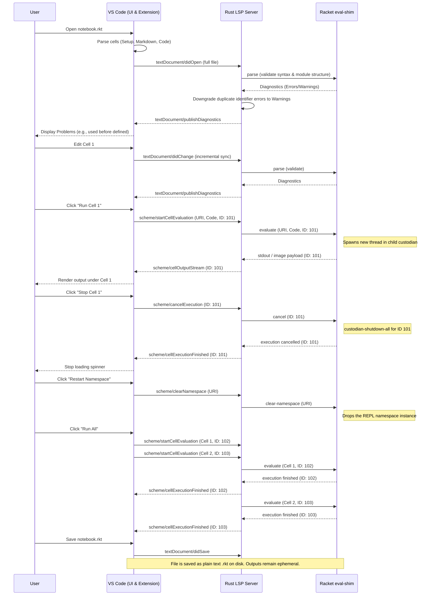

# Evaluation: Racket/Scheme Notebook Renderer via Scheme Toolbox LSP

## 1. Concept Overview

A Notebook environment in VS Code allows users to interleave rich markdown text with executable code cells (akin to Jupyter notebooks). By leveraging the Scheme Toolbox Language Server Protocol (LSP) implementation, we can create a native VS Code Notebook Controller and Renderer for Racket/Scheme.

Instead of relying on an external Jupyter kernel (like [IRacket](https://github.com/rmculpepper/iracket)) and the heavy Jupyter ecosystem (Python, ZeroMQ, etc.), the VS Code extension would directly use the Scheme Toolbox LSP to evaluate code cells. The existing `eval-shim.rkt` architecture can be extended or repurposed to act as the execution engine for notebook cells, capturing `stdout`, `stderr`, and returned values (including serialized images from libraries like `2htdp/image`).

## 2. Technical Details

### 2.1 Architecture Components

1.  **Notebook Serializer (`NotebookSerializer`):**
    *   **Responsibility:** Converts a standard `.rkt` file on disk into VS Code's `NotebookData` by treating it as a "Pure Code" notebook.
    *   **Format:** The extension will parse `.rkt` files to extract cells dynamically using a "Pure Code" approach:
        *   **Setup Cell:** The `#lang` declaration is treated as the initial setup cell, establishing the namespace.
        *   **Markdown Cells:** Special block comments (e.g., `#| markdown ... |#`) are parsed as Markdown cells.
        *   **Code Cells:** Every other top-level expression in the `.rkt` file is treated as its own independent code cell. Standard block comments or line comments are kept as plaintext within the code cell they reside in.
        *   **Output Persistence (Ephemeral):** To maintain true "Pure Code" files, cell outputs (stdout, images, errors) are strictly ephemeral. They are rendered in the VS Code UI during an active session but are **not** serialized or saved to the `.rkt` file on disk. Users must re-run cells upon reopening a notebook to see outputs.

2.  **Notebook Controller (`NotebookController`):**
    *   **Responsibility:** Handles the execution of individual cells or the entire notebook.
    *   **Execution Flow (Streaming):** When a user executes a cell, the VS Code extension sends a custom LSP notification (e.g., `scheme/startCellEvaluation`) with the cell's URI, code, and a unique `executionId`. It does **not** use a blocking Request-Response command.
    *   **Cancel Execution Flow (Custodian Shutdown):** If the user stops a cell's execution, the VS Code extension sends a custom LSP notification (`scheme/cancelExecution`) with the `executionId`. The Rust server forwards this command over `stdin` to the running `eval-shim.rkt`. The shim looks up the specific child `custodian` associated with that execution and calls `(custodian-shutdown-all child-cust)`. This safely terminates the infinite loop thread *and* reclaims any leaked resources (file ports, sockets) without killing the primary background evaluator.
    *   **LSP Backend (Asynchronous Custodians):** The Rust LSP server receives the notification and dispatches the code to the Racket `eval-shim.rkt`. Instead of blocking the main `eval-shim` loop (which would break autocomplete), the shim spawns an asynchronous Racket `thread` managed by a `custodian` to evaluate the cell. The `executionId` is stored in a thread-local parameter. As the thread evaluates the expression, it streams intermediate outputs back to the VS Code extension via custom server-to-client notifications (e.g., `scheme/cellOutputStream`), tagging every payload with the `executionId`. This ensures the VS Code UI can route `stdout` or images back to the exact cell that triggered them, even if multiple cells run concurrently. *Note: This asynchronous threaded evaluation paradigm should replace the current synchronous evaluation model in `eval-shim.rkt` universally, ensuring that standard editor "Send to REPL" requests also do not lock up the LSP.*
    *   **Output Capture (Rich Serialization):** The shim evaluates the expression in the appropriate namespace. To capture rich output (like a `snip%` from `2htdp/image`), `eval-shim.rkt` will override Racket's `current-print` parameter. When an expression evaluates to a graphical object, the handler will draw the snip to a bitmap `dc%`, convert it to a Base64-encoded PNG byte string, and serialize it back to the Rust LSP via JSON (`{ "type": "image/png", "data": "..." }`).

3.  **Notebook Renderer (`NotebookRenderer`):**
    *   **Responsibility:** Displays the results in the notebook output cell.
    *   **MIME Types:** VS Code natively handles `text/plain`, `text/html`, and standard image types (`image/png`, `image/svg+xml`).
    *   **Rich Racket Types:** The controller assigns the `image/png` MIME type to the cell output received from the custom `current-print` handler.
    *   **Custom Renderers:** If we want to support interactive Racket GUI elements or specific visualizations, a custom webview-based Notebook Renderer extension would be necessary.

### 2.2 Namespace & State Management
*   **REPL Emulation vs. Strict Module Compilation:** A `.rkt` file is inherently a module, which forbids redefining identifiers at the top level. However, a notebook requires an interactive REPL where redefinitions are common during iteration.
*   **The Shadow REPL & Dynamic Diagnostics:** To resolve this paradox, the `eval-shim.rkt` will emulate a REPL environment (using `module->namespace` or `make-base-namespace`), allowing interactive redefinitions.
*   **Diagnostic Degradation & Out-of-Order Execution:** When the Scheme Toolbox LSP detects that a file is being opened via the Notebook Controller (rather than the standard text editor), it can dynamically downgrade the severity of "duplicate identifier" compilation errors from `Error` to `Warning` (or `Information`). This allows the user to iterate interactively without the file turning completely red.
*   **Solving the Linear Execution Paradox:** Because notebooks allow out-of-order execution (e.g., running Cell 3 before Cell 1), the REPL state can easily drift from the linear file structure on disk. To solve this without building a complex custom dependency graph, we rely on the LSP's built-in static analysis. Even if a user interactively defines `x` in Cell 2 and then successfully evaluates `(display x)` in Cell 1, the LSP will still flag Cell 1 with a "used before initialization" warning because the `.rkt` file *must* remain a valid, top-to-bottom module for external compilation. This provides immediate, built-in visual feedback that the notebook's physical layout is out of sync with its execution state.
### 2.3 Notebook Renderer API & Webview Architecture
VS Code's Notebook API uses a **hybrid rendering model** to balance high-performance text editing with the flexibility of rich web outputs.
*   **The Mainframe (Core):** Renders the notebook shell and handles code editing using the standard Monaco Editor. This ensures that Racket code cells have full access to the Scheme Toolbox LSP (IntelliSense, hovers, semantic highlighting, inlay hints).
*   **The Webview (Isolated):** Renders the output of cells. For security and performance, custom renderers operate inside a sandboxed Webview (an iframe). They do not have access to the Node.js or VS Code Extension API.
*   **Messaging Bridge:** Because the renderer is sandboxed, it communicates with the main Extension Host (which controls the Racket LSP) via an asynchronous message passing API (`context.postMessage`). This bridge is how interactive outputs (like a running Racket GUI or a continuous REPL output) can stream data back and forth.

### 2.4 Hypothetical Racket Notebook UI
Given the capabilities of the Notebook API, a Racket-tailored notebook UI would look like this:

*   **The Cell Editor:** A standard VS Code editor window supporting Racket syntax highlighting and LSP features. The user types `(+ 1 2)` or `(circle 50 "solid" "red")`.
*   **The Cell Toolbar:** Standard execute, clear, and move buttons. We would add a custom **"Restart Namespace"** button to specifically clear the LSP's underlying Racket evaluator state for that notebook.
*   **The Output Webview:**
*   **Standard Output:** Prints `stdout` and `stderr` in standard ANSI-colored text blocks. If a Racket macro throws a syntax error, it renders as red text.
*   **Rich Images (2htdp/image):** If a cell returns a Racket `snip%` or image, the `eval-shim.rkt` serializes it to a Base64 PNG. The VS Code renderer receives the `image/png` MIME type and renders an `` tag directly in the output cell.
*   **Interactive Visualizations:** For advanced Racket libraries (like `plot`), the renderer could receive a custom JSON MIME type (e.g., `application/vnd.racket.plot+json`) and use a JavaScript charting library (like Plotly.js or Vega) inside the Webview to render a zoomable, interactive graph.
*   **DrRacket-Style REPL Log:** The notebook could optionally mimic the DrRacket interactions window, where the results of evaluated expressions are appended continuously, and users can click on returned values to inspect them.

### 2.5 Interaction Sequence Diagram

The following Mermaid sequence diagram maps out the exact message flow between the user, the VS Code UI/Extension, the Rust LSP Server, and the Racket `eval-shim`. It illustrates the core interactions: opening a file, relying on standard LSP diagnostics for file validation, streaming cell evaluation, and handling execution cancellation.

### 2.6 Cross-Editor Compatibility (Helix, Zed)
Because the Notebook format is built entirely upon "Pure Code" (`.rkt` files with standard comments) rather than a proprietary JSON wrapper (`.ipynb`), the file remains 100% accessible to editors that do not support native notebook UIs, such as Helix, Zed, or Neovim.

*   **Reading and Editing:** A user opening the `.rkt` notebook in Helix sees standard Racket code. The Markdown cells are simply block comments (`#| markdown ... |#`), preventing the file from looking corrupted. The Scheme Toolbox LSP will still provide standard IntelliSense, hover, and diagnostics across the entire file.
*   **The "Send to REPL" Fallback:** While these editors lack the interactive UI to render images inline or display cell-by-cell outputs, the underlying execution architecture (the asynchronous custodian threads) is entirely decoupled from the UI.
*   **Command parity:** The Rust LSP server exposes the execution logic via custom commands. A user in Zed or Helix can use a hotkey to trigger a standard "Send Selection to REPL" or "Evaluate File" command. The Rust server receives the code, spawns the Racket execution thread, and returns the streamed text output (ignoring Base64 images) to the editor's status line, output pane, or a connected terminal buffer.
*   **Diagnostic Degradation:** The LSP must be smart enough to apply the "Dynamic Diagnostic Degradation" (downgrading duplicate identifier errors to warnings) only when the client explicitly identifies itself as a Notebook Controller or when a specific workspace setting is toggled. Otherwise, a Helix user editing the file as a standard module would see confusing warnings instead of the expected strict compiler errors.

## 3. Scheme Toolbox LSP vs. Existing Paradigms

### 3.1 Jupyter and IRacket
IRacket is a Jupyter kernel for Racket. To use it in VS Code, the user must install Python, Jupyter, Jupyter's VS Code extension, ZeroMQ, and the IRacket kernel itself.

**Pros:**
*   **Ecosystem:** Full access to Jupyter's rich ecosystem (nbconvert, JupyterLab, existing `.ipynb` renderers).
*   **Maturity:** The Jupyter protocol is heavily battle-tested for cell execution, interrupt signals, and rich media transport.

**Cons:**
*   **Heavy Dependencies:** Requires a full Python installation and Jupyter tooling.
*   **Fragmentation:** The LSP and the Jupyter kernel are two completely separate processes. They do not share syntax trees, macro expansion states, or memory. This leads to discrepancies in autocomplete/hover vs. actual cell execution.
*   **Setup Friction:** Difficult for beginners to set up correctly across different OS environments.

### 3.2 Scribble (Racket's Literate Programming)
Scribble is Racket's native documentation and report generation tool. It weaves Racket code and text together to produce HTML or PDF outputs.

**Pros:**
*   **Native & Deeply Integrated:** Ships with Racket. Used for all official Racket documentation.
*   **High Quality Output:** Excellent typesetting and layout control for books, papers, and manuals.

**Cons:**
*   **Not Interactive:** It is a batch-build tool, not a live interactive REPL environment. Users compile documents rather than iteratively running cells.
*   **Syntax Overhead:** Relies on its own `@`-expression syntax rather than standard Markdown, which introduces a learning curve for standard notebook users.

### 3.3 Marimo (Reactive Notebooks)
Marimo is a modern, reactive notebook paradigm (popularized in Python) where notebooks are saved as pure code files and execution is modeled as a reactive graph (like a spreadsheet) rather than a linear REPL.

**Pros:**
*   **Reproducibility:** Eliminates hidden state since cells automatically re-run when their dependencies change.
*   **Git-Friendly:** Because notebooks are pure scripts, version control, diffing, and merging are trivial compared to JSON-based `.ipynb`.

**Cons:**
*   **Paradigm Shift:** Requires users to adapt to a reactive flow (e.g., no redefining variables across cells).
*   **Implementation Complexity:** Building a reactive DAG executor inside the LSP's Racket evaluator would be massively more complex than traditional linear execution.

### 3.4 Scribble with Markdown and Interactive Evaluation
An alternative hybrid approach is to use standard Markdown (or a specific markdown `#lang`) coupled with Racket's Scribble engine (specifically `scribble/eval`) running behind a live, interactive UI.

**Pros:**
*   **Familiar Syntax:** Markdown lowers the barrier to entry while retaining the power of Racket for executable fences.
*   **Dual Output:** Can seamlessly export to high-quality static documents (PDF/HTML via Scribble) while still serving as a live interactive notebook in the IDE.
*   **Leverages Existing Evaluation:** Could potentially reuse `scribble/eval`'s sandboxed evaluators, giving robust, documented ways to handle interaction logs and examples.

**Cons:**
*   **Impedance Mismatch:** Scribble is inherently a whole-document, batch-compiled pipeline. Adapting its evaluation model to support isolated, out-of-order, incremental cell execution (typical in notebook UIs) is highly complex.
*   **LSP Integration Complexity:** To provide autocomplete and hover in Markdown fenced code blocks, the LSP server would need specific logic to extract, concatenate, and maintain context for Racket code embedded in Markdown.

### 3.5 Native Scheme Toolbox LSP Notebooks
Using the Scheme Toolbox LSP and VS Code's native Notebook API.

**Pros:**
*   **Unified Tooling:** Autocomplete, hover, inlay hints, and execution are all driven by the exact same Racket evaluator namespace.
*   **Zero Extra Dependencies:** No Python, ZeroMQ, or Jupyter required. Users just install the VS Code extension and the LSP binary.
*   **Performance:** Avoiding the ZeroMQ/Jupyter middle layers can reduce execution latency for fast, small cell evaluations.
*   **Tightly Integrated UI:** Native integration into VS Code's extension host.

**Cons:**
*   **Reinventing the Wheel:** Need to implement execution state, interruption handling (canceling a running cell), and output serialization manually.
*   **Format Lock-in:** Unless we strictly adhere to `.ipynb`, we lose compatibility with tools like GitHub's native notebook renderer or `nbviewer`.

---

## 4. SWOT Analysis

### Strengths (Internal)
*   **Shared Context:** Code editing features (LSP) and code execution (Notebook) use the same backend state and AST.
*   **Lightweight:** Radically simpler installation process for the end-user compared to IRacket.
*   **Existing Infrastructure:** `eval-shim.rkt` already possesses the ability to evaluate Racket code and return structured JSON responses to the Rust server.

### Weaknesses (Internal)
*   **Development Effort:** Implementing robust notebook execution (handling infinite loops, strict stdout/stderr redirection per cell, accurate line numbers in errors) is complex.
*   **Image/Rich Media Serialization:** Racket's `racket/gui` or `2htdp/image` snips need to be manually intercepted and converted to byte arrays (PNG/SVG) within the `eval-shim.rkt` before being sent back over LSP.
*   **Execution Interruption:** Terminating a single cell's execution without killing the entire LSP server requires complex thread/custodian management in Racket.

### Opportunities (External)
*   **Educational Use:** A zero-setup Racket notebook environment in VS Code would be a massive boon for educational settings (e.g., *How to Design Programs*).
*   **Data Science in Racket:** Could spur adoption of Racket for data manipulation and visualization if the friction of tooling is removed.
*   **Unique Feature:** Very few languages have a unified LSP + Notebook Controller extension. Rust (via `rust-analyzer` + `evcxr`) and TypeScript (via Deno/Bun) are the closest comparisons.

### Threats (External)
*   **Jupyter Dominance:** Users are very accustomed to standard Jupyter workflows and `.ipynb` files. If we use a custom format, adoption will be highly localized.
*   **Paradigm Shifts (e.g., Marimo):** As users migrate towards reactive, pure-code notebook paradigms (like Marimo), a traditional linear REPL notebook might feel dated.
*   **Existing Workflows (Scribble):** Advanced Racket users might prefer to stick with Scribble for literate programming rather than adopting a new notebook format.
*   **Maintenance Burden:** Racket's internal API for standard output ports and thread custodians might change, breaking the notebook execution model.
*   **Alternative Web IDEs:** Web-based platforms (like Replit, or native Jupyter web) might eclipse local IDE usage for casual/educational users, reducing the target audience for a VS Code extension.

## 5. Conclusion

Implementing a Notebook Controller/Renderer natively backed by the Scheme Toolbox LSP is highly viable and offers a substantially better user experience in terms of setup and editor integration compared to IRacket. The primary technical hurdles lie in **evaluator state persistence**, **cell interruption (custodian management)**, and **rich media serialization**.

By adopting a **"Pure Code" approach** (where notebooks are standard `.rkt` files with specialized comments rather than JSON-based `.ipynb` files), the ecosystem avoids format lock-in, ensures extreme git-friendliness, and guarantees that notebooks remain valid Racket code. Overcoming the paradox of strict module compilation versus interactive REPL emulation via dynamic diagnostic degradation will be the key to making this paradigm successful.

---

## 6. MVP Refinement: The Sandboxed Notebook

### 6.1 Problem Statement
How Might We build a rock-solid, inline execution environment for students learning Racket that cleanly handles infinite loops and rich media, without introducing the immense engineering complexity of custom thread/custodian management or external Jupyter dependencies?

### 6.2 Recommended Direction
**The "Pure Code" Notebook powered by `racket/sandbox`.**
We will implement a native VS Code Notebook Controller where every `.rkt` file is treated as a notebook. The critical innovation is replacing the complex, manual `eval-shim.rkt` thread management with Racket's built-in `racket/sandbox` (`make-evaluator`). When a user runs a cell, the VS Code extension sends the text to the LSP, which passes it to the persistent sandbox evaluator. The sandbox natively handles timeouts (killing infinite loops gracefully) and resource limits. We will accept standard Jupyter-style "state drift" (where the execution state doesn't match the top-to-bottom file structure) and provide a "Restart" button for when students get confused.

### 6.3 Key Assumptions to Validate
1. **Assumption 1 (Serialization):** We assume we can easily override the `current-print` handler *inside* a `racket/sandbox` evaluator to intercept `2htdp/image` snips, convert them to Base64 PNGs, and emit them as JSON to stdout without breaking the sandbox's security boundaries.
2. **Assumption 2 (LSP Integration):** We assume the Rust LSP can reliably parse the interleaved `stdout` (normal text) and JSON (images) emitted by the Racket shim and stream them correctly to VS Code's `NotebookRenderer` API.
3. **Assumption 3 (Diagnostic Downgrade):** We assume we can implement the "Dynamic Diagnostic Degradation" in the Rust LSP (turning "duplicate identifier" errors into warnings) without rewriting the entire Racket parser, enabling interactive REPL workflows in a `.rkt` module.

### 6.4 MVP Scope
*   **File Format:** Read/write standard `.rkt` files. Special block comments (`#| markdown ... |#`) are rendered as Markdown cells; everything else is a Code cell.
*   **Execution Engine:** `eval-shim.rkt` refactored to use `racket/sandbox` for robust execution, timeouts, and state persistence across cells.
*   **Cancellation:** Clicking "Stop" in VS Code uses the sandbox's built-in termination mechanisms to kill the running expression safely.
*   **Output:** VS Code natively renders text output. Images from `2htdp/image` are serialized to Base64 and rendered inline.
*   **Reset:** A custom "Restart Namespace" command that drops the current sandbox and creates a fresh one.

### 6.5 Not Doing (and Why)
*   **NO `scribble/eval`:** The learning curve is too high, and adapting its batch-document output to stream JSON to a VS Code renderer introduces unnecessary impedance mismatch for the MVP.
*   **NO Hidden Linear Syncing:** Automatically re-evaluating the entire file behind the scenes creates UX flickering and complex race conditions. We embrace Jupyter-style out-of-order execution state.
*   **NO Separate Webview REPL:** We maintain the close association between the expression and the value inline in the Notebook.
*   **NO Persistent Output (JSON/ipynb):** Outputs remain ephemeral to keep the underlying file a clean, standard Racket module that can be run outside of VS Code.
