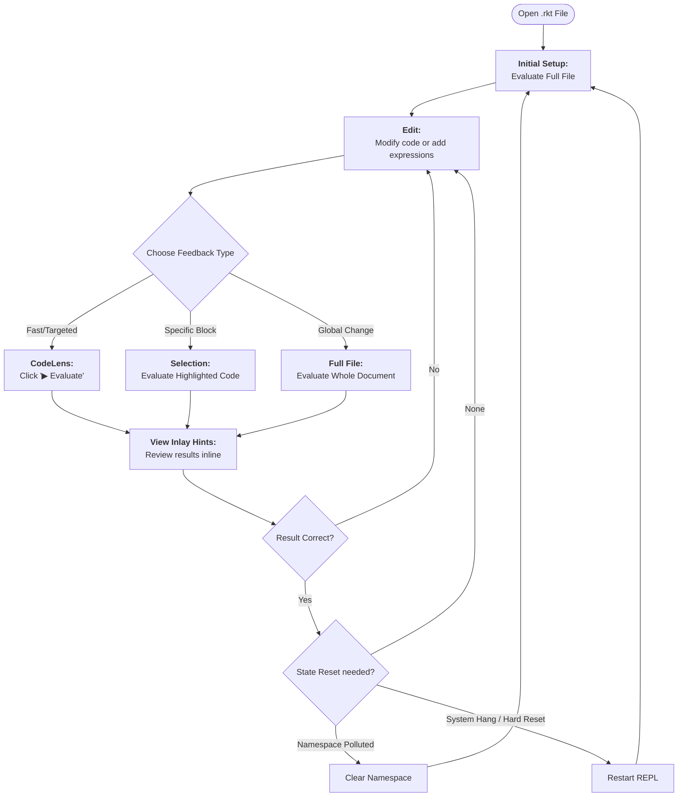

# User Guide: Ideal Editing Workflow for .rkt Files

This guide outlines the most effective way to use the Scheme Toolbox extension to maintain a fast, interactive feedback loop without leaving your editor.

## The Inline REPL Philosophy

Unlike traditional REPLs that live in a separate terminal window, this extension treats the editor itself as the interface. Feedback is delivered via **Inlay Hints** (results appearing at the end of lines) and **Code Lenses** (actionable buttons above expressions).

## Recommended Workflow

1.  **Initialization:**
    Open your `.rkt` file and execute a **Full File Evaluation**. This registers all top-level definitions (`define`, `require`) into the document's private namespace.

2.  **Incremental Iteration:**
    As you write new code, don't re-evaluate the whole file. Instead, click the **"▶ Evaluate" CodeLens** appearing above the specific expression you are working on. Results will appear instantly as Inlay Hints.

3.  **Targeted Selection:**
    For complex multi-line blocks or specific logic fragments, highlight the code and use the **Evaluate Selection** command.

4.  **Managing State:**
    *   **Clear Namespace:** Use this if your environment feels "polluted" with old or conflicting definitions but you want to keep the Racket process running.
    *   **Restart REPL:** Use this for a hard reset if the Racket process hangs or you want to clear all global state.

## Workflow Diagram

## Tips for Success

*   **Look for Red:** Evaluation errors are published as Diagnostics. Check the "Problems" tab if an inlay hint doesn't appear as expected.
*   **Module extraction:** In `#lang racket` files, the extension automatically extracts body forms, allowing you to iterate on individual functions even when they are inside a module.
*   **Keep it surgical:** Frequent small evaluations are faster and easier to debug than periodic full-file evaluations.
